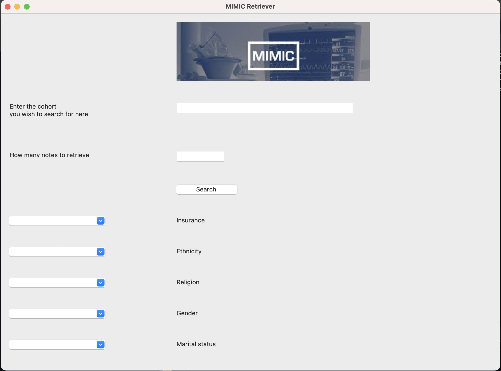

# MIMIC-notes-indexing
Project
## Background: 

According to research, only 20  percent of a person's health outcomes may be attributed to events that occur at the clinician's office.(1) The remainder is determined by individual behavior and the settings and circumstances of people's living environments These variables are referred to as social determinants of health (SDOH). The social determinants of health refer to the social and economic factors that can influence an individual's overall health. These factors can include things like access to education, job opportunities, income, and living conditions. In observational research, the social determinants of health are studied to understand how they impact the health outcomes of individuals or populations. Do research on SDoH can help researchers identify potential interventions or policies that could improve health outcomes and reduce health disparities. 

Cohort identification is an important step in observational research because it allows researchers to identify a group of individuals who share certain characteristics or experiences, and then study how those characteristics or experiences impact their health outcomes. This is important because it allows researchers to isolate specific factors that may be contributing to health outcomes, and to better understand the relationships between different variables. By identifying and studying well-defined patient cohorts, researchers can gain valuable insights that can be used to develop more effective interventions and treatments.

A reliable collection of SDoH data at the point of care can help clinicians provide personalized recommendations to their patients. By understanding the SDoH of their patients, clinicians can tailor their recommendations to address the specific social and economic factors that may be impacting an individual's health. For example, a clinician might recommend a low-cost exercise program to a patient who lives in a low-income neighborhood, or refer a patient to a financial assistance program if they are having trouble paying for their medications.


## Steps 
Extracting SDoH information from EHR - MIMIC iii database 

1. We first indexed all discharge notes from noteevents table. 
2. Built a tf-idf retriever 
3. Created UI of the retrieval tool 


## Run the system
to run the boolean retriever 
```
python retrieval_tool/boolean_retriever.py
```
you can get cohort text using  ```boolean_retriever.get_text()```
and get structured data using ```boolean_retriever.get_structure()``` 
example result see 
to run the retriever UI 
```
python retrieval_tool/Retriever.py 
```

##  UI 


 
